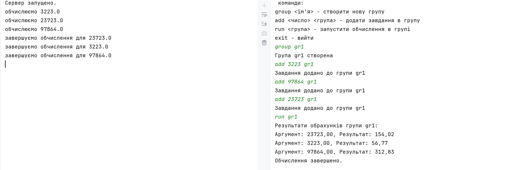

**Використовуємо заданий порт 8080 для взаємодії клієнтської частини та сервера.**


- ComputationManager запускає сервер на порту 8080 і чекає на підключення клієнтів
- Client запускається на порту 8080, підключається до сервера, відправляє доступні команди та отримує результати обчислень


Користувач може використовувати команди:
 - group <```groupname```> - для створення групи з ім'ям ```groupname```
 - add <```число```> <```value```> - для додавання нового чилсла для обрахунків до групи ```groupname```
 - run <```groupname```> - для запуску обрахунків для групи ```groupname``` із доданими до неї числами
 - exit - для виходу з програми


***Обробка команд:***
Основна ідея полягала в тому, щоб кожне завдання обраховувалось у окремому потоці
- При створенні групи Створюється новий потік для неблокуючого виконання,
  відправляється запит на сервер через сокет,
  Сервер створює нову групу і зберігає її в Map для зручності подальшої роботи
- При додаванні числа до групи Створюється новий потік,
  відправляється запит на сервер через сокет,
  Сервер знаходить групу за ім'ям і додає число до неї
- При використанні команди run <```groupname```> сервер створює окремі потоки для кожного завдання в грпі  -> ``` (new Thread())```, кожен потік виконує обчислення та зберігає результат у спільний список,
  після завершення всіх потоків сервер відправляє результати клієнту

- Результати обрахунків зберігаюсться у *synchronizedList* який є безпечним для потокових операцій.

Приклад використання:

